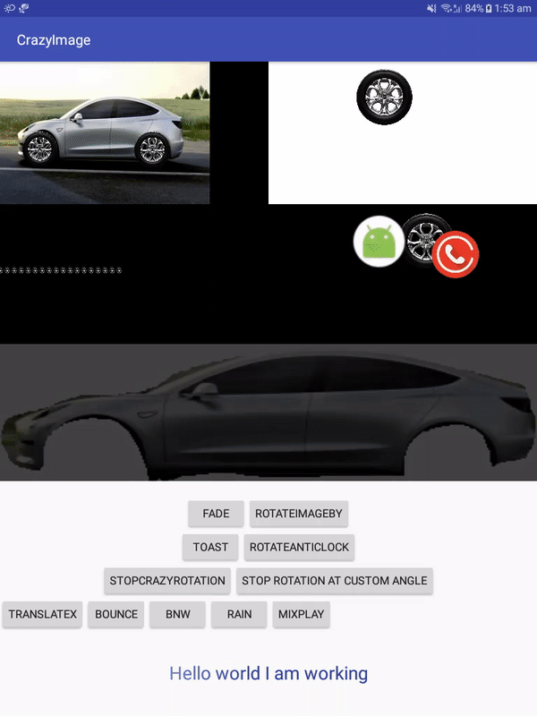

# FriskyImage
This is an android library which help to do frisky stuffs with your ImageViews
Include this line on your app level build.gradle file under <b>dependencies</b> </BR>
<code>compile 'dwijrajbhattacharyya.FriskyImage:FriskyImage:2.0.0'</code> </BR>

<h1> How to integrate them ^ </h1>
	<h4> Moving Car </h4>
	The moving car animation is a customization done using various API's provided by this library here is the XML Here's the java code to run car using Various APIs

```xml
						<FrameLayout
                         	android:layout_weight="50"
                            android:layout_width="0dp"
                            android:layout_height="wrap_content">
                            <ImageView
                                android:id="@+id/car"
                                android:layout_width="300dp"
                                android:layout_height="wrap_content"
                                android:background="@drawable/car1" />
                            <de.hdodenhof.circleimageview.CircleImageView xmlns:app="http://schemas.android.com/apk/res-auto"
                                android:id="@+id/Image1"
                                android:layout_width="50dp"
                                android:layout_height="50dp"
                                android:layout_marginLeft="32dp"
                                android:layout_marginTop="100dp"
                                android:background="@drawable/wheels"
                                app:civ_border_color="#FF000000"
                                app:civ_border_width="2dp" />
                            <de.hdodenhof.circleimageview.CircleImageView xmlns:app="http://schemas.android.com/apk/res-auto"
                                android:id="@+id/Image2"
                                android:layout_width="52dp"
                                android:layout_height="52dp"
                                android:layout_marginLeft="192dp"
                                android:layout_marginTop="100dp"
                                android:background="@drawable/wheels"
                                app:civ_border_color="#FF000000"
                                app:civ_border_width="2dp" />
                        </FrameLayout>

```
```java
						FriskyTanslations Wheel1=new FriskyTanslations(MainActivity.this,R.id.Image1);
```		
Here's the java code to run car using Various APIs
	
```java
				FriskyTanslations Wheel1=new FriskyTanslations(MainActivity.this,R.id.Image1);
                FriskyTanslations Wheel2=new FriskyTanslations(MainActivity.this,R.id.Image2);
                Wheel1.StartRotationClockWise();
                Wheel2.StartRotationClockWise();
                FriskyTanslations Car=new FriskyTanslations(MainActivity.this,R.id.car);
                Car.MoveXBy(-140,3000);
                Wheel1.MoveXBy(-140,3000,true);
                Wheel2.MoveXBy(-140,3000,true);
```	
		
In a nutshell create an object of <strong> FriskyTranslation </strong> by passing the Context and View
		Call it's various functions and tune the parameter's to get your work done 
		just 3-6 lines to move a car!!
	
<h4> Colliding Animation! </h4>
The colliding animation provides 2 default colliding animations namely FriskyBounce,CrazyBounce which have more Subdivision's 
		as visible on the video each animation can be done in just a few lines exmaple

```java
				FriskyBounce friskyBounce1=new 			     	 
				FriskyBounce(MainActivity.this,R.id.RootId123,R.id.ID1234ID);
				FriskyBounce friskyBounce1=new FriskyBounce(MainActivity.this,R.id.RootId123,R.id.ID1234ID);
                FriskyBounce friskyBounce2=new FriskyBounce(MainActivity.this,R.id.RootId123,R.id.ID1235ID);
                FriskyBounce friskyBounce3=new FriskyBounce(MainActivity.this,R.id.RootId123,R.id.ID1236ID);
                friskyBounce1.StartCrazyBounce1(3000);
                friskyBounce2.StartCrazyBounce2(3000);
                friskyBounce3.StartBounce(5000,3000);				
				FriskyBounce friskyBounce=new FriskyBounce(MainActivity.this,R.id.RootId123,R.id.ID123ID);
                friskyBounce.StartCrazyBounce3(3000);
				FriskyBounce friskyBounce=new FriskyBounce(MainActivity.this,R.id.RootId123,R.id.ID123ID);
                friskyBounce.StartCrazyBounce3(3000);
```
Just create an object on FriskyBounce with Context,RootLayout and the view to be animated's ID and tune parameter's 
to integrate them !
Also you can customize them as visible on the video

<h4> 
	Rain animation 
</h4>

Here's the code to integrate rain
        
```java 
          new FriskyRain().StartRain(R.drawable.rain_drop,R.id.Root1235,-10,MainActivity.this); 
```

Just send the raindrop's image the layout on which the rain animation is to be carried out 
		and the context and you are good to go
	
<h4>
       Fading animation
</h4>

Here's how to integrate fade animation
```java
		  new FriskyFade().InfiniteRepeat
                        (bitmap1,MainActivity.this,R.id.FadeLayout,5000);
```
Create and Object of FriskyFade and call it's various flavours with an array/arrayList of Image to show in the Fade In Animation
		The Layout on which the animation is to be carried out and the duration and you are done
<h4>FriskyToast!</h4>
Customize the Boring Deafult Android Toast and notch up your application by writing the same line 
there are 5 default flavours of FriskyToast namely Successs,info,error success,Warning and also customizable 
function by passing various values

```java     
			FriskyToast.warning(MainActivity.this,"WarningToast",Toast.LENGTH_SHORT).show();
            FriskyToast.success(MainActivity.this,"Successs",Toast.LENGTH_SHORT).show();
            FriskyToast.info(MainActivity.this,"Info",Toast.LENGTH_SHORT).show();
            FriskyToast.error(MainActivity.this,"Error",Toast.LENGTH_SHORT).show();
            FriskyToast.custom(MainActivity.this,"CustomToast",R.drawable.ic_launcher,Color.BLACK,3000,true,true).show();
```	 
This is similar to android's default toast with the exception of FriskyToast.custom where you need to pass more 
		values like Icon IconTnt TextTnt Duration and two boolean
<h4>FriskyShimmer</h4>
Use shimmering View to give your view's a shiny effect in just 2 line's
exmaple
For Textview
XML 

```xml
		   <dwijraj.FriskyView.FriskyFriskyShimmerTextView
                    android:layout_width="match_parent"
                    android:text="Hello world I am working"
                    android:textSize="23sp"
                    android:gravity="center"
                    android:id="@+id/FriskyShimmer"
                    android:textColor="@color/colorPrimaryDark"
                    android:layout_height="120dp" />		
```	
Java code
```java
	    shimmerTextView=(FriskyFriskyShimmerTextView) findViewById(R.id.FriskyShimmer);
		FriskyShimmer shimmer=new FriskyShimmer();
        shimmer.setDuration(5000);
        shimmer.start(shimmerTextView);
```	
